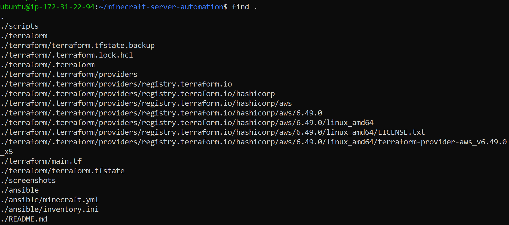
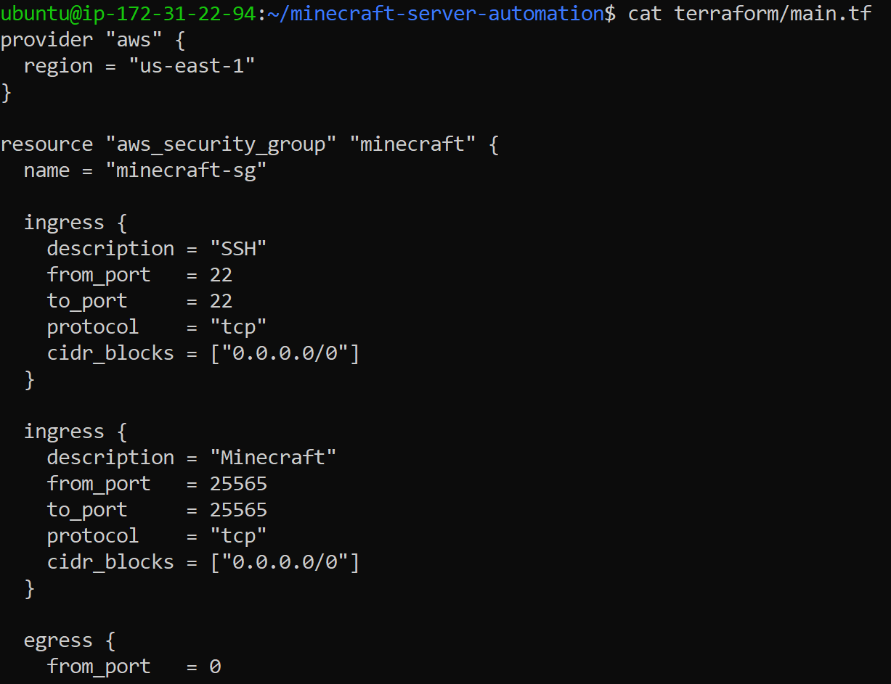
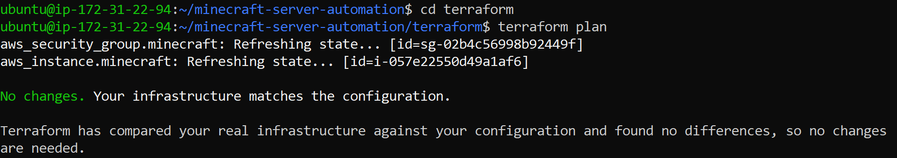
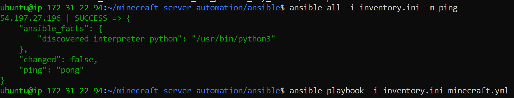
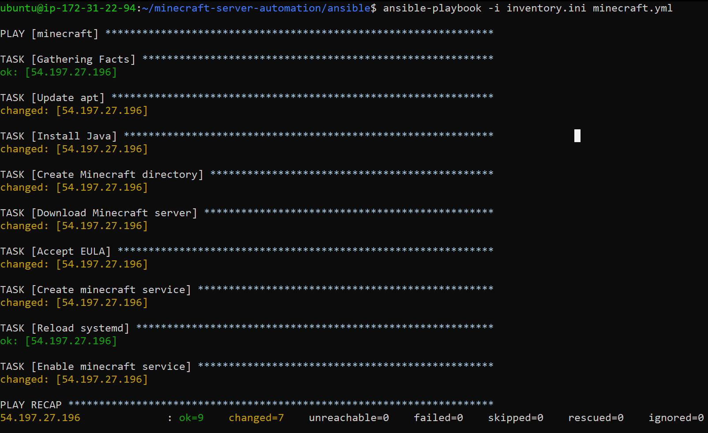
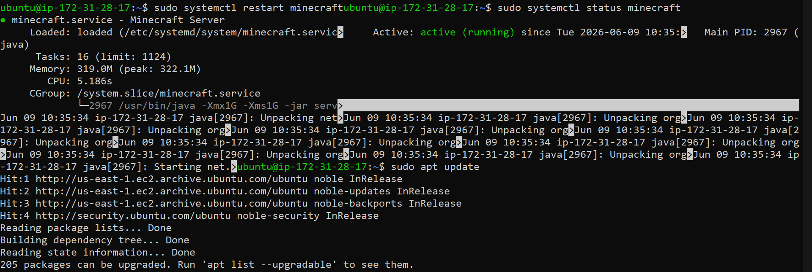
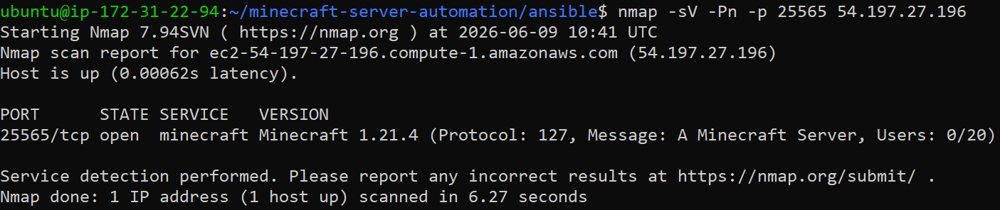

# Minecraft Server Automation

## Introduction

This project automates the deployment and configuration of a Minecraft server on Amazon Web Services (AWS) using Infrastructure as Code (IaC) and configuration management tools. The objective was to create a repeatable deployment process that provisions cloud infrastructure and configures a fully functional Minecraft server without manually using the AWS Management Console.

Terraform was used to provision AWS resources, including an EC2 instance and security group. Ansible was used to install Java, deploy the Minecraft server, accept the EULA, and configure a systemd service for automatic startup and management. Verification was performed using systemd status checks and Nmap service detection.

---

## Requirements

The following software and services were used:

* Ubuntu 24.04 LTS
* Terraform v1.15.5
* Ansible Core 2.16.3
* AWS EC2
* Nmap 7.94
* Git
* SSH Key Pair

---

## Architecture Overview

```text
Control Node
    |
    | Terraform
    v
AWS EC2 Instance
    |
    | Ansible
    v
Java + Minecraft Server + systemd
    |
    | TCP 25565
    v
Minecraft Clients
```

Terraform is responsible for provisioning AWS infrastructure while Ansible performs operating system configuration and Minecraft deployment tasks.

---

## Repository Structure

```text
minecraft-server-automation/
├── terraform/
│   └── main.tf
├── ansible/
│   ├── inventory.ini
│   └── minecraft.yml
├── scripts/
├── screenshots/
│   ├── figure1-repository-structure.png
│   ├── figure2-terraform-configuration.png
│   ├── figure3-terraform-state.png
│   ├── figure4-ansible-ping.png
│   ├── figure5-ansible-playbook.png
│   ├── figure6-minecraft-service.png
│   └── figure7-nmap-verification.png
└── README.md
```

### Figure 1 – Repository Structure



The repository is organized into separate directories for infrastructure provisioning, configuration management, screenshots, and documentation. This organization improves maintainability and makes the deployment process easier to understand and reproduce.

---

## Infrastructure Provisioning with Terraform

Terraform was used to create the AWS infrastructure required for the Minecraft server deployment.

### Figure 2 – Terraform Configuration



The Terraform configuration defines an AWS EC2 instance and a security group. The security group allows SSH access on port 22 and Minecraft traffic on port 25565.

### Figure 3 – Terraform State Verification



Terraform verifies that the deployed infrastructure matches the desired configuration. The output confirms that the AWS resources are successfully provisioned and synchronized with the configuration files.

---

## Server Configuration with Ansible

After infrastructure provisioning was completed, Ansible was used to automatically configure the Minecraft server.

Tasks performed by the playbook include:

* Updating package repositories
* Installing Java
* Creating the Minecraft installation directory
* Downloading the Minecraft server
* Accepting the Minecraft EULA
* Creating a systemd service
* Enabling automatic startup

### Figure 4 – Ansible Connectivity Test



The successful Ansible ping confirms communication between the control node and the Minecraft server. This verifies that SSH connectivity and remote management are functioning correctly.

### Figure 5 – Ansible Playbook Execution



The Ansible playbook automatically configures the Minecraft server by installing dependencies, deploying the Minecraft application, and configuring the service management system.

---

## Service Verification

After configuration was completed, the Minecraft server was started and managed using systemd.

### Figure 6 – Minecraft Service Running



The service status confirms that the Minecraft server is active and running. Running Minecraft as a systemd service provides automatic startup, service monitoring, and recovery capabilities.

---

## Network Verification

Network verification was performed using Nmap to confirm external accessibility.

### Figure 7 – Nmap Verification



Nmap successfully detected the Minecraft service running on TCP port 25565. Service detection identified the application as Minecraft version 1.21.4, confirming that the deployment was successful and externally accessible.

---

## Running the Project

### Step 1 – Clone the Repository

```bash
git clone <repository-url>
cd minecraft-server-automation
```

### Step 2 – Provision AWS Infrastructure

```bash
cd terraform
terraform init
terraform plan
terraform apply
```

### Step 3 – Configure the Minecraft Server

```bash
cd ../ansible
ansible-playbook -i inventory.ini minecraft.yml
```

### Step 4 – Verify Deployment

```bash
nmap -sV -Pn -p 25565 <server-ip>
```

Expected output:

```text
25565/tcp open minecraft Minecraft 1.21.4
```

---

## Results

The project successfully automated the deployment and configuration of a Minecraft server on AWS. Terraform provisioned the required infrastructure while Ansible configured the operating system and Minecraft application. Service verification confirmed that the Minecraft server was operational and accessible from the network.

The deployment process can be repeated without manually interacting with the AWS Management Console, demonstrating the effectiveness of Infrastructure as Code and configuration management automation.

---

## Resources and Sources

* Terraform Documentation: https://developer.hashicorp.com/terraform/docs
* Ansible Documentation: https://docs.ansible.com/
* AWS EC2 Documentation: https://docs.aws.amazon.com/ec2/
* Minecraft Server Documentation: https://www.minecraft.net/
* Nmap Documentation: https://nmap.org/docs.html
* Ubuntu Documentation: https://ubuntu.com/server/docs

